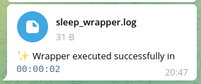
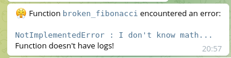
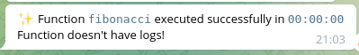

# telegram_logger
Log your python processes with Telegram bot

Create a telegram bot, copy its API token and activate it with the account you want to receive log information from.
For the context decorator to work correctly you must have the `TG_API_TOKEN` variable in your OS environment. The chat ID can be set directly in code or also with the `TG_CHAT_ID` env variable. To simplify the process of setting variables, you can install the [dotenv](https://pypi.org/project/python-dotenv/) module and create an .env file with variable/value pairs in your working directory. The module will try to load this data automatically on import.

## Examples

```python
from tg_logger import telegram_logger, get_chatid

id = get_chatid()
with telegram_logger(chat_id=id, name='sleep_wrapper'):
    print('What a wonderful day to sleep!')
    time.sleep(2)
```


Info from stdout and stderr goes to log file with function name(decorator) or your custom name(context manager, by default name='wrapper').

```python
@telegram_logger(id)
def broken_fibonacci(n):
    a, b = 0, 1
    raise NotImplementedError("I don't know math...")

broken_fibonacci(10)
```

```python
@telegram_logger(id)
def fibonacci(n):
    a, b = 0, 1
    for _ in range(n):
        yield a
        a, b = b, a + b

fibonacci(10)
```

